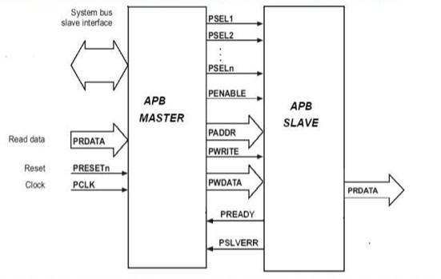
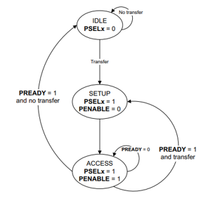
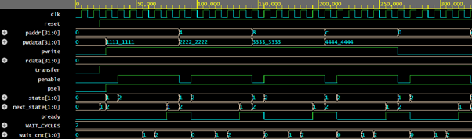

# Advanced Peripheral Bus (APB) Implementation Using Verilog

## Overview

This project presents the design and implementation of the Advanced Peripheral Bus (APB) protocol using Verilog HDL. The design consists of an APB Master and APB Slave communicating through standard APB control, address, and data signals. The implementation supports read and write transactions, wait-state insertion, error handling, and back-to-back transfers.

## Features

- APB Master and APB Slave implementation
- Read and write transactions
- Wait-state generation using PREADY
- Error indication using PSLVERR
- Back-to-back transfer support
- Internal memory implementation
- FSM-based protocol control
- Comprehensive testbench verification

## APB Signals

| Signal | Description |
|----------|------------|
| PCLK | APB clock |
| PRESETn | Active-low reset |
| PADDR | Address bus |
| PSEL | Slave select |
| PENABLE | Access phase indicator |
| PWRITE | Read/Write control |
| PWDATA | Write data bus |
| PRDATA | Read data bus |
| PREADY | Transfer completion signal |
| PSLVERR | Error indication |

## APB Protocol Phases

### IDLE
- PSEL = 0
- PENABLE = 0
- No transfer active

### SETUP
- PSEL = 1
- PENABLE = 0
- Address and control signals are valid

### ACCESS
- PSEL = 1
- PENABLE = 1
- Data transfer occurs
- Transfer completes when PREADY = 1

## System Architecture

## APB FSM

## Wait-State Implementation

The slave supports configurable wait-state generation using the PREADY signal. A wait counter is used to model slower peripheral devices and delay transaction completion.

## Back-to-Back Transfer

The design supports consecutive APB transactions without returning to the IDLE state, improving communication efficiency.

## Test Cases

- Write and Read Back Test
- Address Overwrite Test
- Invalid Address Test
- Read Before Write Test
- Reset During Transaction Test
- Maximum Address Test
- Multiple Address Access Test
- Back-to-Back Transfer Test

## Simulation Results

Other test cases simulation results are in the report.

## Project Report

Detailed report available in the report folder.

## Author

Dharmi Patel
